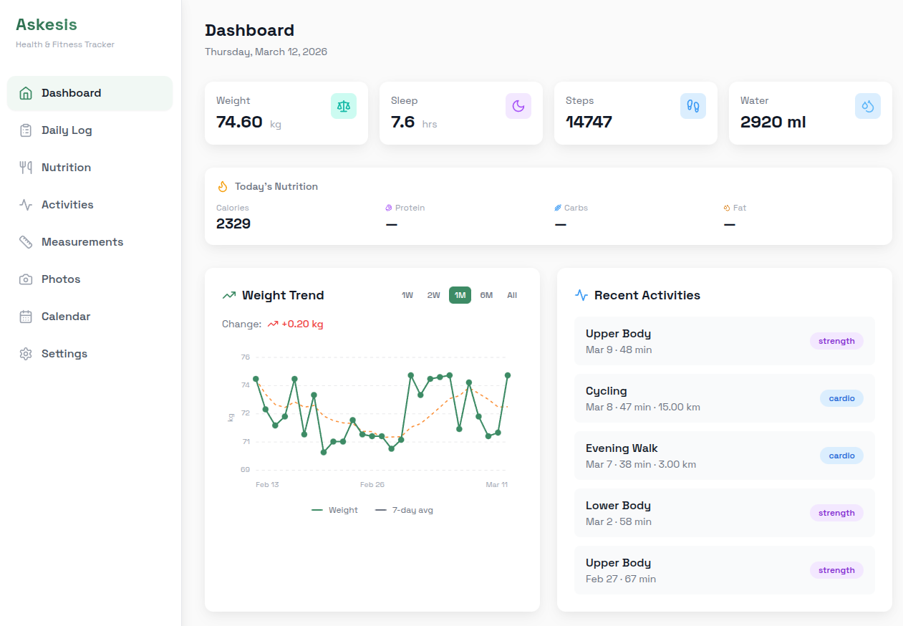
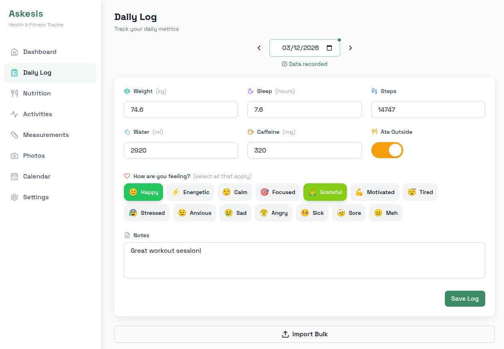

# Askesis

[](https://github.com/vkotaru/askesis.app/actions/workflows/ci.yml)
[](https://opensource.org/licenses/MIT)

A personal fitness tracking app for daily logs, nutrition, progress photos, and body measurements.

<p align="center">
  
  
</p>

## Features

- **Daily Log** - Track weight, sleep, energy levels, and notes
- **Nutrition** - Log meals and track macros
- **Progress Photos** - Front/side/back photos stored in your Google Drive
- **Measurements** - Track body measurements over time
- **Activities** - Log workouts and exercises
- **Calendar** - View your history at a glance
- **Data Sharing** - Share progress with coaches or accountability partners

## Tech Stack

- **Frontend**: SvelteKit + TailwindCSS
- **Backend**: FastAPI + SQLAlchemy + Alembic
- **Database**: PostgreSQL (SQLite for local dev)
- **Auth**: Google OAuth
- **Photo Storage**: Google Drive API
- **Deployment**: Railway

## Local Development

### Prerequisites

- Python 3.12+
- Node.js 20+
- Google Cloud project with OAuth credentials

### Backend Setup

```bash
cd backend
python -m venv venv
source venv/bin/activate
pip install -r requirements.txt

# Create .env file
cat > .env << EOF
DEV_MODE=true
DATABASE_URL=sqlite:///./askesis.db
SECRET_KEY=$(openssl rand -hex 32)
EOF

# Run migrations
alembic upgrade head

# Start server
./start.sh
```

### Frontend Setup

```bash
cd frontend
npm install
npm run dev
```

App runs at http://localhost:5173

## Production Deployment (Railway)

[Railway](https://railway.app) is a platform that makes deploying apps easy - connect your GitHub repo and it handles the rest.

### Quick Start

1. **Create a Railway account** at [railway.app](https://railway.app)
2. **New Project** → **Deploy from GitHub repo** → Select this repo
3. **Add a PostgreSQL database**: Click **+ New** → **Database** → **PostgreSQL**
4. **Set environment variables** (see table below) in the service settings
5. Railway auto-deploys on every push to main

The app uses `nixpacks.toml` and `railway.json` for build configuration - no Dockerfile needed.

### Environment Variables

| Variable | Description |
|----------|-------------|
| `DATABASE_URL` | PostgreSQL connection string |
| `SECRET_KEY` | Random 32+ character string |
| `GOOGLE_CLIENT_ID` | OAuth client ID |
| `GOOGLE_CLIENT_SECRET` | OAuth client secret |
| `ALLOWED_EMAILS` | Comma-separated list of allowed emails |
| `CORS_ORIGINS` | Frontend URL(s) |
| `DRIVE_FOLDER_NAME` | Name for photos folder (default: "Askesis Progress Photos") |
| `DRIVE_PARENT_FOLDER_ID` | Optional: parent folder ID in Google Drive |

### Google Cloud Setup

1. Create a project at [Google Cloud Console](https://console.cloud.google.com)
2. Enable the Google Drive API
3. Configure OAuth consent screen:
   - Add scope: `https://www.googleapis.com/auth/drive.file`
4. Create OAuth 2.0 credentials (Web application)
5. Add authorized redirect URI: `https://your-domain.com/auth/callback`

## License

MIT
