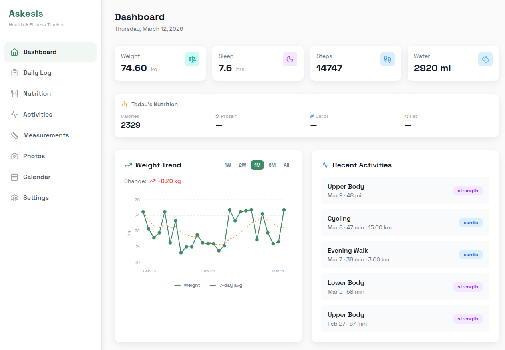
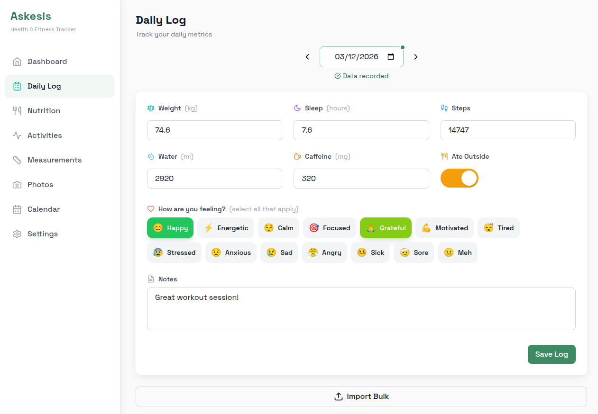

# Askesis

[](https://github.com/vkotaru/askesis.app/actions/workflows/ci.yml)
[](https://opensource.org/licenses/MIT)

A personal fitness tracking app for daily logs, nutrition, progress photos, and body measurements.

<p align="center">
  
  
</p>

## Features

- **Daily Log** - Track weight, sleep, energy levels, and notes
- **Nutrition** - Log meals and track macros
- **Progress Photos** - Front/side/back photos stored on your own server
- **Measurements** - Track body measurements over time
- **Activities** - Log workouts and exercises
- **Calendar** - View your history at a glance
- **Data Sharing** - Share progress with coaches or accountability partners

## Tech Stack

- **Frontend**: SvelteKit + TailwindCSS, offline-first via Dexie/IndexedDB
- **Backend**: FastAPI + SQLAlchemy + Alembic
- **Database**: PostgreSQL (SQLite for local dev)
- **Auth**: username + password, httponly cookie session
- **Photo Storage**: the server's own disk (bind-mounted `./data/uploads`)
- **Deployment**: self-hosted Docker on a home server, behind Tailscale (see [SELF_HOSTING.md](SELF_HOSTING.md))

## Local Development

### Prerequisites

- Python 3.12+
- Node.js 20+

### Backend Setup

```bash
cd backend
python -m venv venv
source venv/bin/activate
pip install -r requirements.txt

# Create .env file
cat > .env << EOF
DEV_MODE=true
DATABASE_URL=sqlite:///./askesis.db
SECRET_KEY=$(openssl rand -hex 32)
EOF

# Run migrations
alembic upgrade head

# Start server
./start.sh
```

### Frontend Setup

```bash
cd frontend
npm install
npm run dev
```

App runs at http://localhost:5173

`DEV_MODE=true` bypasses login entirely and signs you in as a synthetic
`dev@askesis.local` user, so no account setup is needed locally.

## Production Deployment (self-hosted)

Askesis runs as a single Docker image (SvelteKit SPA + FastAPI served same-origin)
on a home server, reachable only over your tailnet via a Tailscale sidecar.

```bash
cp .env.example .env    # fill in secrets + TS_AUTHKEY
./deploy.sh             # git pull, docker compose down, up --build
# → https://askesis.<your-tailnet>.ts.net
```

[SELF_HOSTING.md](SELF_HOSTING.md) is the full runbook — first-time setup, the
Tailscale sidecar, and the gotchas.

### Environment Variables

| Variable | Description |
|----------|-------------|
| `DATABASE_URL` | PostgreSQL connection string |
| `SECRET_KEY` | Random 32+ character string (`openssl rand -hex 32`) |
| `CORS_ORIGINS` | JSON array of allowed origins |
| `UPLOADS_DIR` | Where photos are written (defaults to `backend/uploads`) |
| `USDA_API_KEY` | Optional — food-database lookups |
| `GEMINI_API_KEY` | Optional — AI meal-photo analysis |

### Creating accounts

There is no sign-up page. Accounts are created on the server:

```bash
docker compose exec app python backend/scripts/manage_users.py \
    create --username you --email you@example.com --name "Your Name"
```

It prompts for the password twice. `set-password --username you` resets one,
and `list` shows every account.

## Mobile

Askesis is a PWA — install it from the browser on Android or iOS. It works
offline (IndexedDB) and syncs when it reconnects.

There is no separate native app. The Capacitor wrapper and the native Kotlin
client were both retired in `v0.1.0-pre-simplify`; check out that tag if you
need them.

## License

MIT
